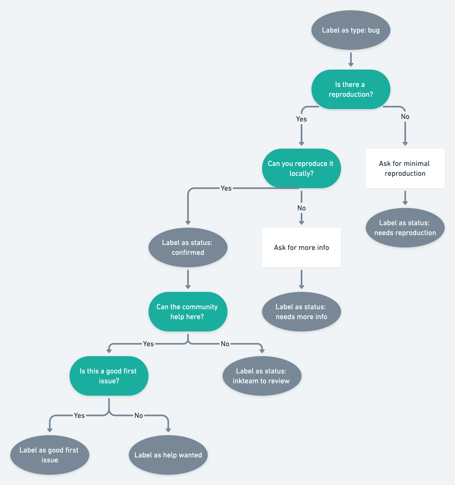
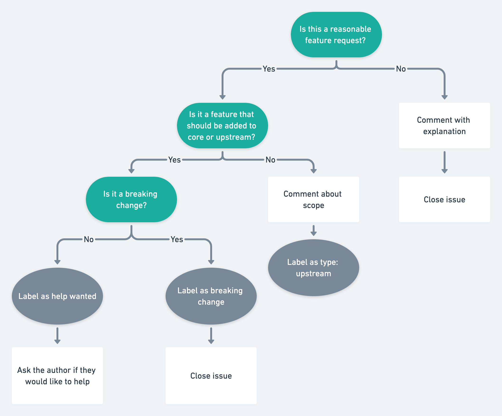
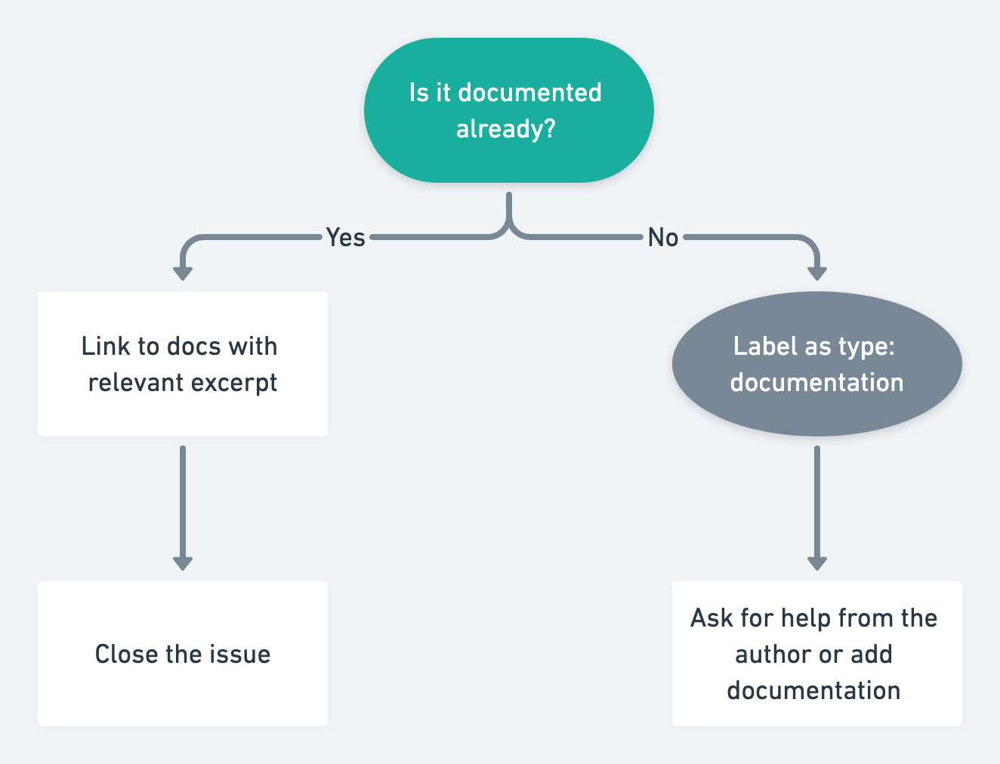

## What is the aim of this document?

On the Gatsby core team, we've found patterns that help us effectively triage incoming GitHub issues, provide answers to the community's questions, identify bugs, and provide contribution opportunities. Triaging issues is a great way to contribute to the Gatsby community and share your knowledge, without necessarily requiring a lot of deep context about the way the Gatsby codebase works.

We want to share these patterns with the broader community, so that if you're interested in helping us triage, you're able to do so more effectively!

In this document we’ll answer common questions, list guidelines and illustrate a decision tree.

## First touch maintenance

For Gatsby the first line of communication between a user and the team is the issue tracker on GitHub. Typically, every day 20-30 issues are opened -- that's one every hour!

An opened issue could be:

- [a question that can be answered immediately](#questions-with-immediate-answers)
- a bug report
- a request for a feature
- or a discussion on a complicated use case

On the core team, we regularly designate someone to be a first touch maintainer. That person might sift through, triage, communicate and manage this first line of communication.

First touch maintainers will typically:

- [answer questions by pointing to documentation](#questions-with-immediate-answers)
- test and reproduce possible bug reports and label them appropriately
- communicate feature requests to the rest of the team and ensure a valid response
- enable discussions on complicated use cases, whether themselves or via the rest of team

## Why do we do first touch maintenance?

We do first touch maintenance so that:

- Questions are answered swiftly and correctly, therefore making users happy
- Bug reports are reproducible and the most relevant data is collected before someone jumps in with a fix
- Unrelated issues are resolved promptly so we don't spend too much time on them

## What is unique to Gatsby?

Gatsby is unique among most open source projects because:

- Gatsby integrates with many third party tools (WordPress, Drupal, Contentful etc) via source plugins and hence the typical scope of issues is widened significantly
- Gatsby aims to be really beginner friendly (we want to be the new way someone gets started with web development) and this means that we need to accommodate a wide range of skill levels
- At Gatsby, we've defined a couple of metrics that we measure to ensure we're responsive and helpful to our open source community

## How do we do first touch maintenance?

### General guidelines

- **Be empathetic.** The author of an issue might be asking something that’s obvious to you but that doesn’t mean it’s obvious to them - it's important to consider the issue from the author’s viewpoint. People often remember how you make them feel, not what you told them.
- **Add context.** When answering an issue, it can be useful to link to existing documentation, issues, PRs, or provide related context. This means the issue can serve as a reference to future readers.
- **Encourage community contributions.** Getting people involved makes a huge impact. It’s often worth spending the time to write up a task as a `good first issue` instead of fixing the issue yourself. This can provide a low friction way for someone to get more involved in open source!
- **Give issue authors time to close their own issues.** Sometimes, it might feel like an issue is resolved but the author could have follow up questions. It's usually best to give them a day or two to close the issue themselves.

### Labeling

Labeling helps group issues into manageable sets and also improves searchability and scannability. We have a set of labels that we use to group issues based on their type and status. While we want to limit adding too many labels, feel free to add one if it seems relevant and helps with this grouping!

It's nice to update labels as the state of an issue changes or if the type of an issue changes, for example if a question becomes a feature request. This means labels are transient in nature and subject to being updated as progress is made on addressing issues.

Check out [the docs on issue labeling for more info](/contributing/how-to-label-an-issue/)

### Resolution flowchart

Issues are categorized into one of five types: question or discussion, bug report, feature request, documentation, or maintenance.

### Questions with immediate answers

- Point to existing documentation to answer the question
- If insufficient, do the following:
  1. Provide an answer
  2. Label the issue with documentation
  3. Keep it open until a PR has added the answer to the documentation, and the issue includes a link to said documentation

If an issue comes in as a question with a known answer it can be tempting to answer it and close the issue. However, the consequence of this approach is that the answer to a question others may have is now buried in a closed issue and may be hard to surface. The preferred solution is to get that answer documented in the main Gatsby documentation and connect the issue to an answer by including a docs link.

#### Bug Report

Bug Reports are issues that identify functionality in Gatsby that should work but does not in a given scenario. If an issue is a Bug Report it should include steps to reproduce the problem. If it doesn't, ask the issue filer for those steps and label the issue with `needs reproduction`.

Attempt to reproduce the bug using the steps given. If that's not possible, ask for more information and label the issue as `needs more info`.

If the reproduction is successful label the issue with `confirmed` and determine who is best suited to implement a fix. If it's approachable for the community consider the `help wanted` or `good first issue` labels. Otherwise, label with `inkteam to review` so it can be picked up by a Gatsby team member.

#### Feature Request

Feature Requests are issues that request support for additional functionality not currently covered in the existing codebase. The first step in triaging a feature request is to determine if it's a reasonable request; this is a challenge and if you don't feel comfortable making this determination please label with `inkteam to review`. If it's clear that this isn't a feature it makes sense for Gatsby to implement, provide a comment explaining the decision making and close the issue.

If it's determined to be a worthwhile feature the next decision point is whether the feature should be added to core or upstream. Upstream features should be labeled with `upstream` and include comments about the scope.

If it's a core change, is it a breaking change? Breaking changes should be labeled with `breaking change` and typically closed. Note that they may sometimes be left open with the note that the functionality can only be added in a major release.

Non-breaking changes can be labeled as `help wanted` and it is often best to ask the creator of the issue if they'd be interested in helping develop the PR.

### Documentation

Issues can be filed requesting documentation on a particular topic. Sometimes the documentation already exists, so you can link to it and close the issue.

Otherwise, label the issue with `documentation` and ask the issuer filer if they'd like to help with a PR.

### Maintenance

Maintenance issues are things like bumping a package version. These issues should be labeled with `maintenance`.

### Saved replies

Gatsby team members have saved certain [common form responses](https://github.com/orgs/gatsbyjs/teams/admin/discussions/3) to help accelerate issue triage.

## Bot

We have a bot that helps us automate some aspects:

- Issues with a question mark in their title or starting with "how" are automatically labeled as questions
- Issues with an empty body are closed
- Issues with no activity are marked stale after 20 days. They are then closed after another 10 days unless there are additional comments or the "not stale" label is applied

## Frequently asked questions

> When do I do a demo for an issue?

When a feature or pattern is not documented, it may be nice to make a demo to add clarity for the author and help future readers as well.

> How do I reproduce a bug?

Every bug report should provide details on how to reproduce the bug. This is so important that there's [dedicated documentation on how to create good bug reproductions](/contributing/how-to-make-a-reproducible-test-case/). Encourage issue authors to describe exactly how to reproduce a bug.

> How much time do I spend on an issue?

Some issues might need more time than others and there isn’t any hard and fast rule. However, it's best to spend time on an issue after the relevant info and reproduction is available.

> Do I have to look at Discord?

You don’t have to. Some of us are active on Discord and you can be too if you like.

> Do I use the same issue to track documentation additions or open a new one?

If the issue describes the context well enough, then it is okay to update its title and use the same issue to track the addition of relevant documentation.

> When do I follow up on an issue?

If an author hasn’t responded to a comment for a week or two, it might be nice to follow up and ask if there’s anything else we can do to help. If the issue goes stale after that, our bot should be able to clean it up.

> What do I do if an issue relates to something upstream?

It’s a good practice to open an issue in the upstream repository in cases like this but isn’t strictly necessary. Upstream in this case refers to repositories that house dependencies for Gatsby.
